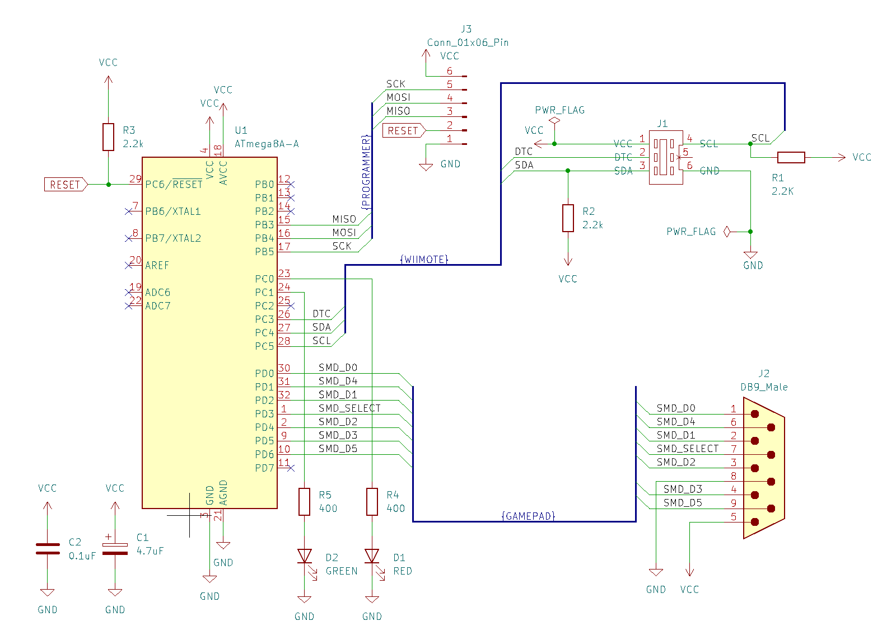
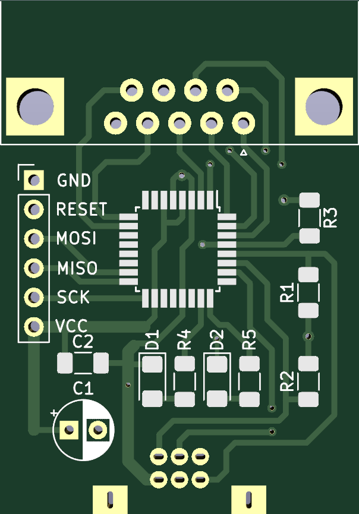
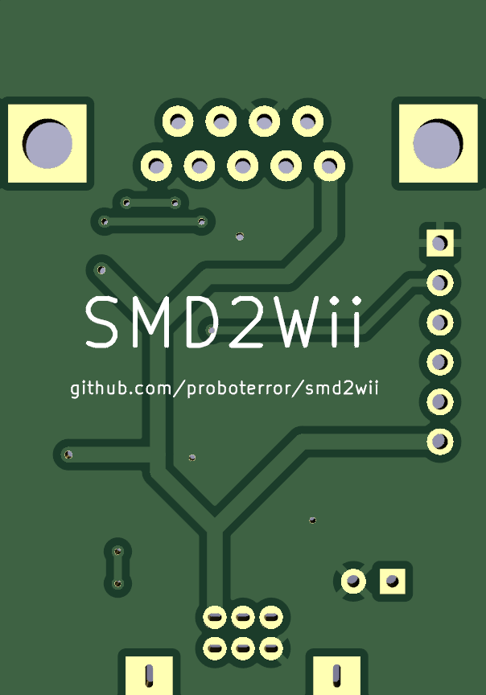
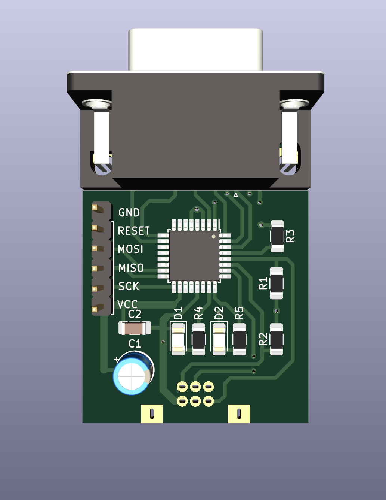

# SMD2Wii
SMD2Wii - adapter for Sega Mega Drive controller to Wii remote.

Adapter emulates Wii Classic Controller with Sega Mega Drive / Genesis 3/6-button controller and can be used with homebrew emulators like Genesis Plus GX and selected Wii Virtual Console Games.<br>
Work not confirmed for NES Classic Mini / SNES Classic Mini.

The goal is to connect SMD 6-button controller to Wii as cheap and simple as possible.<br>
For NES / SNES emulators excellent Nintendo Classic Mini Controller / Nintendo SNES Classic Mini Controller suggested.

Project based on Cluster's [nes2wii](https://github.com/ClusterM/nes2wii) project with following changes:
* Controller replaced with simpler / cheaper ATmega8A
* Deleted all other platforms and second SMD pad support from source code and schematics
* New smaller PCB
* Fixed SMD 6-button pad state query errors
* KiCad 7.0 schematic and PCB sources added

## Schematics



Board:<br>


Assembled board preview without Wiimote connector:


## Fuses 

[Bits configuration](images/fuses.png)

* Low fuse: 0xC4
* High fuse: 0xD9

# Compiling from source
Windows:<br>
Install WinAVR-20100110-install.exe<br>
make all<br>

CH341A programmer and NeoProgrammer V2.2 software can be used for firmware .hex flashing.

## Tested with

* ATmega8A-U, 8MHz
* Third party 6-buttons Sega Mega Drive controller with Mode button ("Retro Genesis 16 Bit ACSg11")
* Software: Genesis Plus GX, FCE Ultra GX, WiiMednafen, RetroArch

## Modes

There are three modes for controller d-pad:
* Mode #1 - d-pad works as left analog stick and d-pad on classic controller at the same time
* Mode #2 - d-pad works as left analog stick only
* Mode #3 - d-pad works as d-pad only

Mode 1 selected by default.

You can hold Start+B+C for a few seconds to change mode. Red led will blink 1/2/3 times indicating new mode.

## Bill of materials
* ATMEGA8A-U TQFP32
* DB9 PCB Connector Angle (DSUB-9 Male Horizontal P2.77x2.84mm Edge Pin Offset 7.70mm Mounting Holes Offset 9.12mm)
* Wii controller 6 Pin 90 degree male connector
* SMD 1206 Resistor 2.2k(222) x3
* SMD 1206 Capacitor 0.1(104) uF x1
* (only for programming) Connector PinHeader 2.54mm 1x06 Vertical
* (optional) Electrolytic Capacitor Radial D5.0mm P2.50mm 4.7 uF
* (optional) SMD 1206 Resistor 400 Ohm x2
* (optional) SMD 1206 LED Red x1
* (optional) SMD 1206 LED Green x1

## Notes


### About delays and interrupts
SMD controller polled every 5 ms. Wiimote classic controller query interrupt disabled during the poll (not sure if interrupt is delayed or cancelled).<br>
Worst case scenario additional input delay is about 5-6 ms (or one frame).<br>
Current code:
```c++
void gamepads_query()
{
	_delay_ms(5); // Must be >= 3 to give 6-button controller time to reset

	cli(); // Disable wiimote poll interrupt

	// 8 iterations for read controller state.
	for (b = 0; b < 8; b++)
	{
		// Were can be enough CPU ticks in loop cycle without additional delay
		// for short delay to stabilize outputs in controller (needs to be tested with different controllers)
		...read pad pins
		...invert SELECT pin
	}

	sei(); // Enable interrupt

```
See [gamepads.c](gamepads.c) code comments for more details.
### Buttons mapping
Classic controller to SMD buttons mapping:
```c++
a = smd.c;
b = smd.b;
x = smd.y;
y = smd.a;
l = smd.x;
r = smd.z;
select = smd.mode;
start = smd.start;
```

## Author(s)

Original firmware and schematics for ATMEGA16A:<br>
Alexey 'Cluster' Avdyukhin [https://github.com/ClusterM](https://github.com/ClusterM)<br>
[https://github.com/ClusterM/nes2wii](https://github.com/ClusterM/nes2wii)

Sega MD 6-buttons query code and documentation:<br>
[https://github.com/MickGyver/DaemonBite-Retro-Controllers-USB](https://github.com/MickGyver/DaemonBite-Retro-Controllers-USB)<br>
[https://github.com/jonthysell/SegaController](https://github.com/jonthysell/SegaController)

SMD2Wii modifications:<br>
[probotector](https://github.com/proboterror)